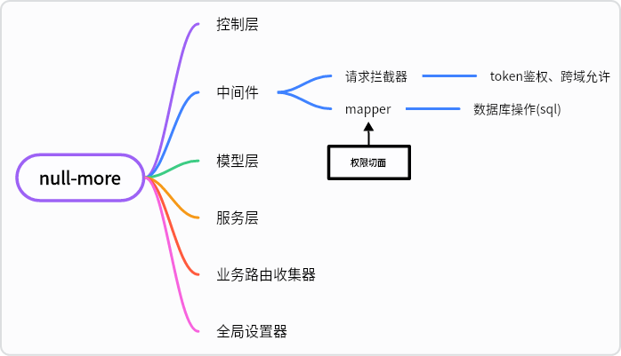

# null-more-learn
Node.js+Express.js+Mysql+Redis+MinIO简单node后端框架项目
## 启动
添加依赖
```
npm install
```
运行命令

```
npm run start
```
打包命令

```
npm run build
```

docker部署
1. 迁移dist目录与docker文件夹至服务器目录下
2. 创建network网络（null-more-network）
3. 进入迁移根目录
4. 运行docker compose构建命令（docker-compose up --build）
5. 对外暴露接口（主应用：7777）


# 设计结构
## 分布式设计
| null-more | Redis | Mysql | MinIO | Nginx |
| -------- | -------- | -------- | -------- | -------- |
| 主应用 | 缓存服务 | 数据库 | 文件服务 | 网关 |
| 负责业务服务 | 数据缓存服务 | 数据存储服务 | 文件管理服务 | 简单网关服务 |
## null-more应用服务分层设计

### 分层设计分工
    网关：Nginx
    控制层：接受业务直接调配，控制其服务层。
    中间件：
        请求拦截器：主控oauth权限验证，CORS跨域约定（Nginx网关也会做）。
        数据库语句操作器：插入权限切面，根据上下文限定sql语句方式控制实际sql。
    模型层：业务抽象模块、DTO临时数据模型。
    服务层：协调模型层与控制层，隔离用户操作与应用内模型、数据库操作。
    路由模块收集器、全局设置器：收集整理控制层模块、收集整理全局设置配置。